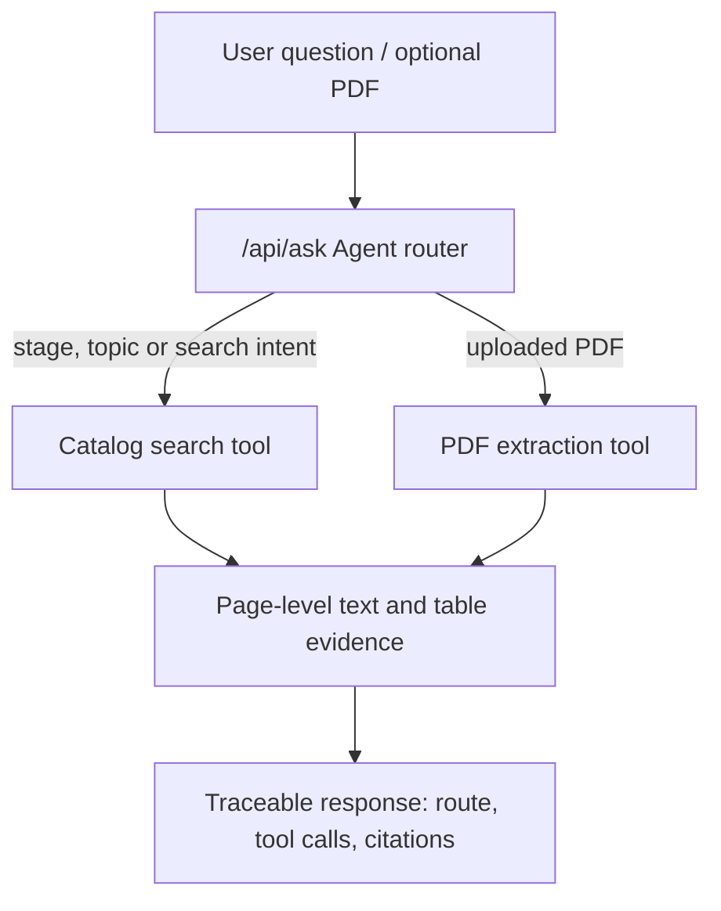

# Document Intelligence Agent

A deployable document intelligence agent for traceable enterprise-knowledge retrieval.

1. **Agent orchestration** - routes each request to catalog search, PDF extraction or a hybrid workflow, then returns its tool trace and citations.
2. **Structured catalog retrieval** - deterministic filters for lifecycle stage, topic and effective date, including an `All` wildcard.
3. **Text-based PDF extraction** - page-level text blocks, native table rows and bounding boxes (`bbox`) returned as JSON.

It intentionally contains **no private documents, company names, credentials, customer data, or external model keys**. Uploaded PDFs are processed in memory and are not written to disk.

## Architecture



The router is deliberately deterministic and model-independent: it remains inspectable and runnable without an API key, while leaving a clean integration point for an LLM or RAG layer.

## Why not use only RAG?

Semantic RAG is useful for questions about what a document says. It is less reliable for strict filters such as "documents for the Build stage, related to Security, effective after a date." This service uses a lightweight, inspectable hybrid foundation:

```text
Structured filtering → deterministic, auditable document selection
PDF extraction       → clean content for chunking, RAG and citations
Agent routing        → select and execute the appropriate tool for a user question
```

## Features

- FastAPI API with OpenAPI documentation at `/docs`
- Browser interface for agent questions, direct catalog search and PDF extraction
- `/api/ask` endpoint that returns the route, tool calls and source citations
- In-memory PDF processing with a 12 MB Docker limit and a Vercel-safe 4 MB limit
- Public synthetic catalog data only
- Configuration through environment variables (`DOCUMENT_AGENT_*`)
- API tests for PDF extraction and validation, plus Ruff and Mypy quality checks
- Dockerfile, Docker Compose and GitHub Actions CI

## Run locally

Requires Python 3.11+.

```bash
git clone https://github.com/<your-username>/document-intelligence-agent.git
cd document-intelligence-agent
python -m venv .venv
source .venv/bin/activate  # Windows: .venv\\Scripts\\activate
pip install -r requirements.txt
uvicorn app.main:app --reload
```

Open <http://localhost:8000>. API documentation is available at <http://localhost:8000/docs>.

Optional runtime configuration:

```bash
export DOCUMENT_AGENT_MAX_PAGES=20
export DOCUMENT_AGENT_LOG_LEVEL=DEBUG
```

## Run with Docker

```bash
docker compose up --build
```

## API examples

```bash
curl -X POST http://localhost:8000/api/search \
  -H 'content-type: application/json' \
  -d '{"lifecycle_stage":"Build","topic":"Security"}'

curl -X POST http://localhost:8000/api/parse \
  -F 'file=@example.pdf'

curl -X POST http://localhost:8000/api/ask \
  -F 'question=Find Build security documents'
```

## Deployment

The repository includes a Vercel entry point at `api/index.py` and routing configuration in `vercel.json`.

1. Sign in to Vercel with GitHub and import `lyt49767-lgtm/document-intelligence-agent`.
2. Keep the detected framework settings and click **Deploy**.
3. Open the generated `vercel.app` URL and verify `/health` and `/docs`.

Vercel Functions accept request bodies up to 4.5 MB, so the app automatically sets its Vercel upload limit to 4 MB. Docker deployments retain the 12 MB default. The Docker image also works on any Docker-compatible host and honors the platform-provided `PORT` value:

```bash
uvicorn app.main:app --host 0.0.0.0 --port $PORT
```

For a public deployment, do not add internal PDFs, and use environment variables for any future model API key.

## Resume-ready summary

See the concise Chinese project description at [`docs/resume-project-description_zh.md`](docs/resume-project-description_zh.md).

## Scope and next steps

This is intentionally a compact, deployable portfolio project rather than a production compliance system. Useful extensions include OCR for scanned PDFs, authentication, rate limiting, semantic retrieval, reranking and an MCP server for external agent clients.
